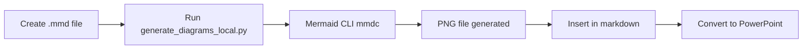

# Diagram Generation - Air-Gap Compatible

## Overview

MARS presentation diagrams are generated using **self-hosted Mermaid CLI** to maintain air-gap capability and avoid third-party cloud services.

## Why Self-Hosted?

**MARS Principle**: All infrastructure must be self-hosted and air-gap capable.

**Security Violation**: Sending diagram source code to external services (e.g., kroki.io) violates:
- Air-gap capability requirements
- Data sovereignty policies
- OPSEC principles (diagram content may contain sensitive architecture details)

## Solution: Local Mermaid CLI

### Tool: @mermaid-js/mermaid-cli

- **Official**: Maintained by Mermaid.js team
- **Self-hosted**: Runs locally using Node.js + Puppeteer (headless Chrome)
- **Air-gap compatible**: Can bundle dependencies offline
- **High quality**: Generates PNG/SVG/PDF at configurable scale
- **No external calls**: Zero network requests to third-party services

### Installation

```bash
cd /workspace/mars-v2/external/mars-artifacts/leadership-pitch

# Install Mermaid CLI locally
npm install @mermaid-js/mermaid-cli

# Verify installation
./node_modules/.bin/mmdc --version
```

### Usage

#### Generate All Diagrams

```bash
cd /workspace/mars-v2/external/mars-artifacts/leadership-pitch

# Generate all Part 6 technical diagrams
python3 generate_diagrams_local.py
```

#### Generate Single Diagram

```bash
cd /workspace/mars-v2/external/mars-artifacts/leadership-pitch

# Generate with transparent background and 3x scale
./node_modules/.bin/mmdc \
  -i diagrams/mermaid/git-worktrees-workflow.mmd \
  -o diagrams/png/git-worktrees-workflow.png \
  -b transparent \
  -s 3
```

#### Generate All Presentation Diagrams

```bash
cd /workspace/mars-v2/external/mars-artifacts/leadership-pitch

# Generate all diagrams (Parts 1-6 + appendices)
python3 generate_pptx_diagrams.py
```

**Note**: `generate_pptx_diagrams.py` has been updated to use local Mermaid CLI instead of Kroki API.

## Diagram Workflow



1. **Create Mermaid source**: Edit `.mmd` files in `diagrams/mermaid/`
2. **Generate PNG**: Run `generate_diagrams_local.py` (uses local Mermaid CLI)
3. **Reference in markdown**: Use `` syntax
4. **Convert to PowerPoint**: Run `./convert_final_to_pptx.sh`

## Air-Gap Deployment

For air-gapped environments:

```bash
# 1. On internet-connected machine: Bundle dependencies
npm pack @mermaid-js/mermaid-cli
# Produces: mermaid-js-mermaid-cli-11.12.0.tgz

# 2. Transfer tarball to air-gapped system

# 3. On air-gapped machine: Install from tarball
npm install ./mermaid-js-mermaid-cli-11.12.0.tgz
```

## Alternatives Considered

| Solution | Air-Gap? | Quality | Complexity | Decision |
|----------|----------|---------|------------|----------|
| **Mermaid CLI** | ✅ Yes | High | Low | ✅ **SELECTED** |
| Kroki.io API | ❌ No | High | Very Low | ❌ Rejected (cloud service) |
| Self-hosted Kroki | ✅ Yes | High | Medium | ⚠️ Adds service dependency |
| Python + Playwright | ✅ Yes | High | High | ⚠️ More complex |
| PlantUML conversion | ✅ Yes | Medium | High | ⚠️ Syntax incompatible |

## Technical Details

### Mermaid CLI Configuration

- **Scale**: 3x (high-resolution output for presentations)
- **Background**: Transparent (integrates cleanly into slides)
- **Format**: PNG (PowerPoint compatible, no SVG rendering issues)
- **Timeout**: 60 seconds per diagram
- **Dependencies**: Node.js 20+, Chromium (via Puppeteer)

### Diagram Inventory (Part 6)

| Diagram | Source | Output | Size |
|---------|--------|--------|------|
| Git Worktrees Workflow | `git-worktrees-workflow.mmd` | `git-worktrees-workflow.png` | 161 KB |
| LiteLLM Architecture | `litellm-architecture.mmd` | `litellm-architecture.png` | 250 KB |
| Sysbox Architecture | `sysbox-architecture.mmd` | `sysbox-architecture.png` | 242 KB |
| Git Submodules (Research) | `git-submodules-research.mmd` | `git-submodules-research.png` | 182 KB |
| Git Submodules (MARS) | `git-submodules-mars.mmd` | `git-submodules-mars.png` | 110 KB |

## Troubleshooting

### Issue: "Mermaid CLI not found"

```bash
# Verify installation
ls -la node_modules/.bin/mmdc

# Reinstall if missing
npm install @mermaid-js/mermaid-cli
```

### Issue: "Puppeteer download failed"

```bash
# Set Chromium download URL (air-gap alternative)
export PUPPETEER_SKIP_CHROMIUM_DOWNLOAD=true

# Use system Chrome instead
export PUPPETEER_EXECUTABLE_PATH=/usr/bin/chromium-browser
```

### Issue: "Permission denied"

```bash
# Make script executable
chmod +x generate_diagrams_local.py

# Fix node_modules permissions
chmod +x node_modules/.bin/mmdc
```

## Related Documentation

- [Mermaid.js Documentation](https://mermaid.js.org/)
- [Mermaid CLI GitHub](https://github.com/mermaid-js/mermaid-cli)
- [MARS UML Server](../../../modules/services/uml-server/README.md) - PlantUML rendering
- [Air-Gap Deployment Guide](../../../docs/wiki/AIR_GAP_DEPLOYMENT.md) (if exists)

## Future Enhancements

1. **Containerized Mermaid CLI**: Add Docker image for consistent rendering environment
2. **CI/CD Integration**: Auto-generate diagrams in GitLab pipeline
3. **Pre-commit Hook**: Validate diagrams before commit
4. **Diagram Registry**: Track diagram versions and dependencies
5. **Batch Regeneration**: Detect .mmd changes and auto-regenerate PNGs
