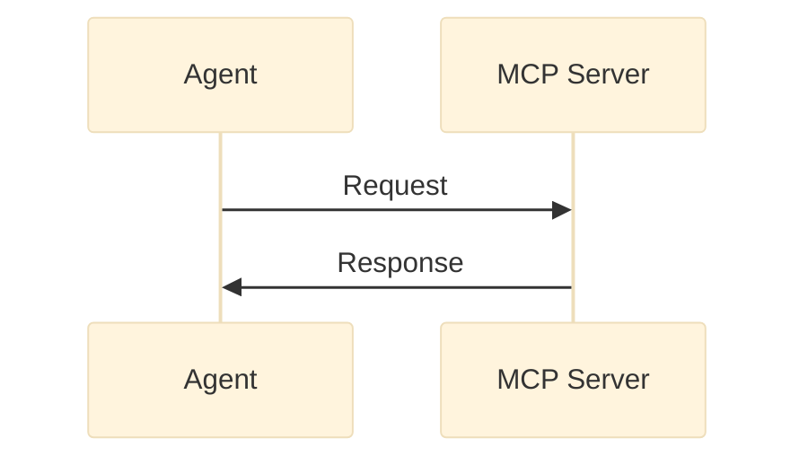
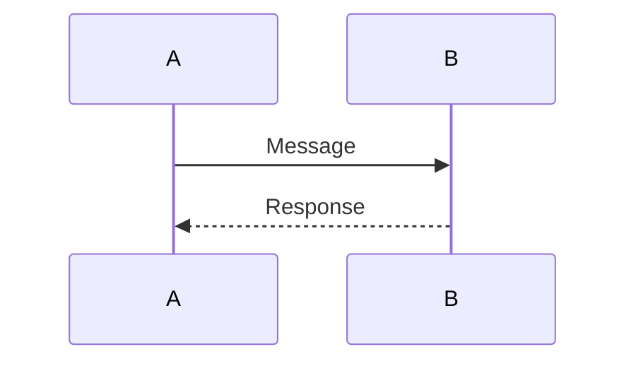
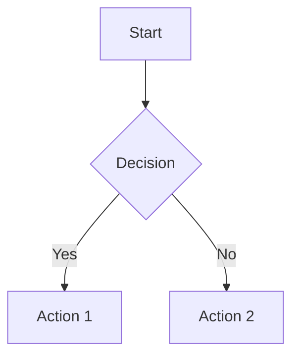
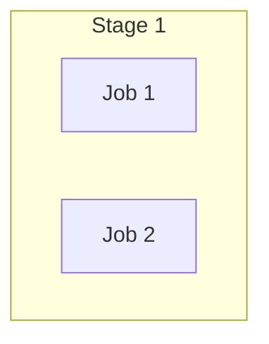

# Leadership Brief Diagrams

This directory contains high-quality diagrams for the MARS Leadership Brief, replacing ASCII art with professional Mermaid diagrams.

## Directory Structure

```
diagrams/
├── mermaid/              # Mermaid source files (.mmd)
│   ├── mcp-protocol.mmd
│   ├── a2a-protocol.mmd
│   ├── langgraph-state-machine.mmd
│   ├── opentelemetry-trace.mmd
│   ├── precommit-hook-flow.mmd
│   ├── gitlab-ci-pipeline.mmd
│   ├── merge-request-workflow.mmd
│   └── adr-authoring-workflow.mmd
└── README.md             # This file
```

## Diagrams by Section

### Section 5.10: MARS Standards & Protocols

#### 1. MCP Request/Response Protocol
**File**: `mermaid/mcp-protocol.mmd`
**Type**: Sequence Diagram
**Shows**: How agents communicate with MCP servers (tool providers)

#### 2. A2A Protocol: Shared Context Example
**File**: `mermaid/a2a-protocol.mmd`
**Type**: Sequence Diagram
**Shows**: Agent-to-agent delegation with context preservation

#### 3. LangGraph State Machine Protocol
**File**: `mermaid/langgraph-state-machine.mmd`
**Type**: Flowchart
**Shows**: Stateful workflow with conditional branching

#### 4. OpenTelemetry Trace
**File**: `mermaid/opentelemetry-trace.mmd`
**Type**: Flowchart (hierarchical)
**Shows**: Distributed tracing across multiple agents

### Section 5.12: mars-dev Development Protocols

#### 5. Pre-Commit Hook Execution Flow
**File**: `mermaid/precommit-hook-flow.mmd`
**Type**: Flowchart
**Shows**: Local validation before git commit

#### 6. GitLab CI Pipeline (7 Stages)
**File**: `mermaid/gitlab-ci-pipeline.mmd`
**Type**: Flowchart with subgraphs
**Shows**: Complete CI/CD pipeline with parallel jobs

#### 7. Merge Request Review & Approval
**File**: `mermaid/merge-request-workflow.mmd`
**Type**: Flowchart
**Shows**: Peer review process and automated checks

#### 8. ADR Authoring & Review Workflow
**File**: `mermaid/adr-authoring-workflow.mmd`
**Type**: Flowchart
**Shows**: Process for documenting architectural decisions

## Usage

### Option 1: Automatic PDF Generation (Recommended)

The diagrams are **automatically converted** to PDF during the build process:

```bash
cd external/mars-artifacts/leadership-pitch
./make_pdf.sh
```

This uses the `pandoc-mermaid-filter` to convert Mermaid code blocks in the markdown directly to PDF graphics.

### Option 2: Manual Diagram Rendering

To render individual diagrams to standalone files:

```bash
# Install Mermaid CLI (one-time setup)
npm install -g @mermaid-js/mermaid-cli

# Render single diagram to PNG
mmdc -i diagrams/mermaid/mcp-protocol.mmd -o diagrams/mcp-protocol.png -b transparent

# Render to PDF (for high-quality embedding)
mmdc -i diagrams/mermaid/mcp-protocol.mmd -o diagrams/mcp-protocol.pdf -b transparent

# Render all diagrams at once
for file in diagrams/mermaid/*.mmd; do
    basename="${file%.mmd}"
    mmdc -i "$file" -o "${basename}.pdf" -b transparent
done
```

### Option 3: Live Preview

**VSCode**:
- Install "Markdown Preview Mermaid Support" extension
- Open any `.mmd` file and use preview pane

**Online**:
- Copy/paste Mermaid code to https://mermaid.live/

## Setup Requirements

### Python Dependencies
```bash
pip install pandoc-mermaid-filter
```

Already added to `mars-dev/scripts/python-deps-container.txt`.

### Node.js Dependencies (Optional for manual rendering)
```bash
npm install -g @mermaid-js/mermaid-cli
```

### System Dependencies
```bash
# Ubuntu/Debian
apt install pandoc texlive-full

# macOS
brew install pandoc
brew install --cask mactex
```

## Embedding in Markdown

To use these diagrams in the Leadership Brief:

### Automatic Conversion (Inline Code Block)
````markdown

````

### External File Reference (Standalone Diagrams)
```markdown

```

**Note**: The inline code block method is preferred because:
- Version controlled (diagrams as code)
- Reproducible builds
- Single source of truth (markdown contains both text and diagrams)

## Customization

### Theme Customization

Each diagram has a custom color scheme defined in the `%%{init: {...}}%%` directive:

```mermaid
%%{init: {'theme': 'base', 'themeVariables': {
  'primaryColor': '#e1f5ff',
  'primaryBorderColor': '#0277bd',
  'lineColor': '#0277bd'
}}}%%
```

**Color Palette** (matching MARS branding):
- **MCP Protocol**: Blue tones (`#e1f5ff`, `#0277bd`)
- **A2A Protocol**: Green tones (`#e8f5e9`, `#2e7d32`)
- **LangGraph**: Purple tones (`#f3e5f5`, `#6a1b9a`)
- **OpenTelemetry**: Orange tones (`#fff3e0`, `#e65100`)

### Diagram Syntax

**Sequence Diagrams**:


**Flowcharts**:


**Subgraphs** (for grouping):


See [Mermaid Documentation](https://mermaid.js.org/) for complete syntax reference.

## Benefits Over ASCII Diagrams

| Aspect | ASCII Art | Mermaid Diagrams |
|--------|-----------|------------------|
| **Quality** | Low-resolution, monospace font | High-resolution, publication-grade |
| **Scalability** | Fixed size, pixelated when zoomed | Vector graphics, scales perfectly |
| **Maintainability** | Manual editing, error-prone | Code-based, version controlled |
| **Complexity** | Limited (max ~50 lines readable) | Unlimited (complex workflows supported) |
| **Consistency** | Manual formatting, inconsistent | Auto-formatted, consistent styling |
| **Accessibility** | Screen reader unfriendly | Can include alt text, semantic markup |

## Troubleshooting

### Issue: "pandoc-mermaid-filter not found"
**Solution**: Install Python package
```bash
pip install pandoc-mermaid-filter
```

### Issue: "mmdc command not found"
**Solution**: Install Mermaid CLI (only needed for manual rendering)
```bash
npm install -g @mermaid-js/mermaid-cli
```

### Issue: "Diagram not rendering in PDF"
**Solution**: Verify pandoc filter is being used
```bash
pandoc --list-filters  # Should show 'pandoc-mermaid'
```

### Issue: "Diagram colors look wrong"
**Solution**: Check theme variables in `%%{init: {...}}%%` block

## Contributing

When adding new diagrams:

1. **Create `.mmd` file** in `diagrams/mermaid/`
2. **Use descriptive filename** (e.g., `security-architecture.mmd`)
3. **Add theme customization** (match MARS color palette)
4. **Document in this README** (add to appropriate section)
5. **Test PDF build** (`./make_pdf.sh`)

## References

- **Mermaid Documentation**: https://mermaid.js.org/
- **Pandoc Mermaid Filter**: https://github.com/raghur/mermaid-filter
- **Mermaid CLI**: https://github.com/mermaid-js/mermaid-cli
- **Mermaid Live Editor**: https://mermaid.live/

---

**Last Updated**: 2025-11-11
**Diagram Count**: 8 diagrams (4 from Section 5.10, 4 from Section 5.12)
